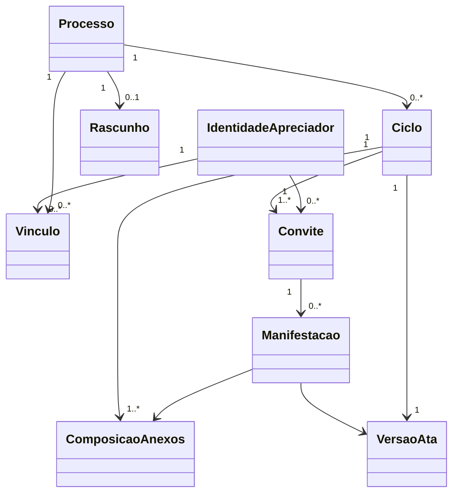
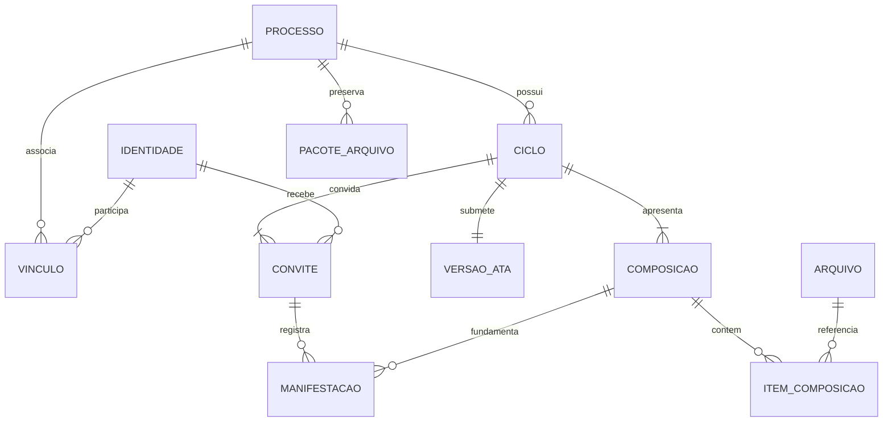
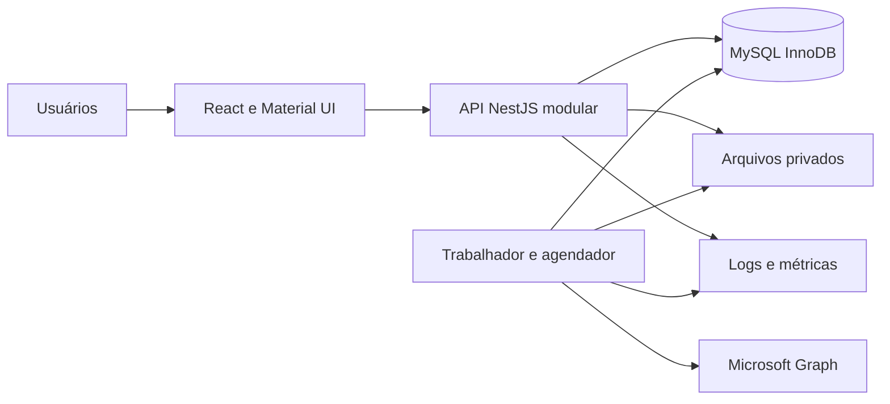

# Sistema de Controle e Aprovação de Atas

Versão: 1.1 (revisão documental de 01/10/2026)  
Status: PLANEJAMENTO APROVADO COM COMPLEMENTOS PENDENTES  
Data da aprovação: 17/09/2026

Revisão: decisões posteriores do usuário incorporadas em 01/10/2026; não autoriza implementação ou implantação.

## 1. Visão e responsabilidade documental

Aplicação institucional para preparar, publicar, apreciar e oficializar atas, preservando cada versão, base documental e decisão individual. Resolve a falta de controle uniforme sobre aceites, prazos, unanimidade e rastreabilidade. Este README define **o que construir e por quê**. Não registra execução, commits ou resultados de testes.

A aprovação autoriza gerar o planejamento, não implementar ou implantar. A proposta técnica foi aprovada na conversa; pendências institucionais continuam explícitas e não são fatos presumidos. A data reflete o contexto disponível da sessão.

Fontes: decisões fornecidas pelo usuário na elicitação, consolidação técnica e aprovação explícita “Aprovo!”. Respostas posteriores prevalecem sobre regras substituídas expressamente. O compartilhamento inicial não continha todo o texto de respostas antigas; detalhes não comprovados permanecem pendentes, conforme PD-010.

## 2. Escopo e fronteiras

Uma instituição; interface web responsiva integral; contas internas; unidades e reuniões; apreciadores por e-mail; rascunho único; ata PDF; anexos informativos versionados; publicação; convites por ciclo; manifestações; prazos/suspensão; unanimidade; encerramentos; histórico e auditoria; e-mails e lembretes; relatórios; arquivo, recuperação e remoções controladas.

Reunião identifica o evento ocorrido; processo é o fluxo de aprovação associado a esse cadastro. Na v1.0, o cadastro gera um processo. Nova tentativa após encerramento definitivo exige novo cadastro/processo; não há reabertura. Não presumir consolidação de múltiplos processos sob a mesma reunião sem novo requisito.

## 3. Fora de escopo

- Consulta histórica alternativa por apreciadores após encerramento definitivo.
- Autenticação corporativa, leitura de e-mail, calendários, OneDrive e SharePoint.
- Reabertura de processo encerrado e reaproveitamento de aceites/manifestações em novo ciclo.
- Editor de atas: conteúdo é produzido externamente. Videoconferência, transcrição, assinatura certificada, votação secreta e colaboração em tempo real não integram o escopo aprovado nem o backlog; inclusão depende de novo requisito.
- Implantação nesta etapa e funcionalidades de MFA antes da decisão institucional correspondente.

## 4. Stakeholders e atores

| Ator | Responsabilidade e objetivo | Permissões e interações |
|---|---|---|
| Administrador | Administrar instituição, contas, unidades e processos | Acesso global; configura limites; vincula Organizadores; arquivo/recuperação/remoções |
| Organizador | Conduzir processos atribuídos | Poderes iguais entre vinculados: preparar/publicar, participantes, prazos, manifestações em consulta, encerrar; não gerencia contas/unidades; perde acesso ao arquivar |
| Apreciador | Decidir sobre a versão aceita | Link por vínculo; aceite autenticado por ciclo; recusa sem sessão; manifestação própria; consulta conforme estado e visibilidade |
| Operação institucional | Sustentar serviço e recuperação | Não recebe automaticamente permissões funcionais; acessos técnicos mínimos definidos na implantação |
| Responsável institucional pela política | Aprovar retenção, segurança e metas | Resolve PDs e aceita condições de produção |
| Trabalhador/agendador | Materializar trabalhos do sistema | Atua com credencial de serviço limitada; valida elegibilidade; não inventa manifestação |
| Microsoft 365 | Receber requisições de envio | Integração exclusivamente de e-mail |

## 5. Requisitos funcionais

### RF-001 — Administrar contas internas
- Descrição/resultado esperado: Criar, ativar, desativar e atribuir papéis a contas locais.
- Atores: Administrador. Prioridade: MUST.
- Pré-condições: autorização e condições de estado definidas em UC-001; decisões bloqueantes resolvidas antes da implementação dependente.
- Regras: RN-002, RN-021. Qualidade: RNF-001, RNF-004, RNF-005. Caso de uso: UC-001.
- Critérios de aceitação: Último Administrador protegido; redefinição revoga sessões; conta desativada não reativa por recuperação.
- Implementação/teste rastreáveis: TASK-006; TEST-001.

### RF-002 — Administrar unidades e reuniões
- Descrição/resultado esperado: Manter unidades e cadastrar reuniões com identificador automático.
- Atores: Administrador; Organizador nas correções autorizadas. Prioridade: MUST.
- Pré-condições: autorização e condições de estado definidas em UC-002; decisões bloqueantes resolvidas antes da implementação dependente.
- Regras: RN-002, RN-023. Qualidade: RNF-001, RNF-003. Caso de uso: UC-002.
- Critérios de aceitação: Campos obrigatórios validados; sigla única; unidade inativa não aceita novos vínculos; correção após publicação tem justificativa.
- Implementação/teste rastreáveis: TASK-009; TEST-002.

### RF-003 — Gerenciar vínculos e convites
- Descrição/resultado esperado: Gerenciar apreciadores ativos, inclusões e remoções com efeito por ciclo.
- Atores: Administrador e Organizador autorizado. Prioridade: MUST.
- Pré-condições: autorização e condições de estado definidas em UC-003; decisões bloqueantes resolvidas antes da implementação dependente.
- Regras: RN-001, RN-005, RN-006, RN-007, RN-008. Qualidade: RNF-001, RNF-002, RNF-003. Caso de uso: UC-003.
- Critérios de aceitação: Recusa não contornável; composição congelada imutável; remoção revoga apenas autorização correspondente.
- Implementação/teste rastreáveis: TASK-014; TEST-003.

### RF-004 — Autenticar apreciador e recuperar acesso
- Descrição/resultado esperado: Emitir senha temporária, abrir sessão e reenviar links por e-mail.
- Atores: Apreciador. Prioridade: MUST.
- Pré-condições: autorização e condições de estado definidas em UC-004; decisões bloqueantes resolvidas antes da implementação dependente.
- Regras: RN-001, RN-019, RN-020. Qualidade: RNF-001, RNF-004, RNF-005. Caso de uso: UC-004.
- Critérios de aceitação: 10min/5 tentativas/60s aplicados; contrato de duração/inatividade da sessão bloqueado até esclarecer PD-010; recuperação não altera participação nem expõe links na página.
- Implementação/teste rastreáveis: TASK-007; TEST-004.

### RF-005 — Preparar ata e rascunho
- Descrição/resultado esperado: Manter uma próxima versão em preparação e descartar conteúdo exclusivo com auditoria.
- Atores: Administrador e Organizador autorizado. Prioridade: MUST.
- Pré-condições: autorização e condições de estado definidas em UC-005; decisões bloqueantes resolvidas antes da implementação dependente.
- Regras: RN-003, RN-004, RN-014, RN-025. Qualidade: RNF-001, RNF-003. Caso de uso: UC-005.
- Critérios de aceitação: Upload não publica; só um rascunho; descarte não remove arquivos publicados.
- Implementação/teste rastreáveis: TASK-012; TEST-005.

### RF-006 — Validar e armazenar documentos
- Descrição/resultado esperado: Receber ata PDF e anexos permitidos em armazenamento privado.
- Atores: Administrador e Organizador autorizado. Prioridade: MUST.
- Pré-condições: autorização e condições de estado definidas em UC-006; decisões bloqueantes resolvidas antes da implementação dependente.
- Regras: RN-015, RN-017, RN-025. Qualidade: RNF-003, RNF-006. Caso de uso: UC-006.
- Critérios de aceitação: Conteúdo e extensão verificados; PDF com senha rejeitado; limites novos não invalidam arquivos existentes.
- Implementação/teste rastreáveis: TASK-011; TEST-006.

### RF-007 — Publicar novo ciclo
- Descrição/resultado esperado: Publicar versão e convites e substituir ciclo anterior atomicamente.
- Atores: Administrador e Organizador autorizado. Prioridade: MUST.
- Pré-condições: autorização e condições de estado definidas em UC-007; decisões bloqueantes resolvidas antes da implementação dependente.
- Regras: RN-003, RN-004, RN-005, RN-009, RN-014, RN-016. Qualidade: RNF-002, RNF-003, RNF-009, RNF-010. Caso de uso: UC-007.
- Critérios de aceitação: Sem dois ciclos correntes; rollback integral em falha; novo ciclo exige novos aceites, preservando links ativos.
- Implementação/teste rastreáveis: TASK-013; TEST-007.

### RF-008 — Aceitar ou recusar convite
- Descrição/resultado esperado: Registrar resposta individual por ciclo.
- Atores: Apreciador. Prioridade: MUST.
- Pré-condições: autorização e condições de estado definidas em UC-008; decisões bloqueantes resolvidas antes da implementação dependente.
- Regras: RN-005, RN-006, RN-007, RN-019, RN-020. Qualidade: RNF-001, RNF-002, RNF-004, RNF-010. Caso de uso: UC-008.
- Critérios de aceitação: Aceite autenticado; recusa explícita sem sessão; prazo/estado impedem resposta inválida; recusa definitiva.
- Implementação/teste rastreáveis: TASK-014; TEST-008.

### RF-009 — Registrar e alterar manifestação
- Descrição/resultado esperado: Registrar decisões sucessivas sem sobrescrever histórico.
- Atores: Apreciador com aceite válido. Prioridade: MUST.
- Pré-condições: autorização e condições de estado definidas em UC-009; decisões bloqueantes resolvidas antes da implementação dependente.
- Regras: RN-012, RN-013, RN-016, RN-019. Qualidade: RNF-001, RNF-002, RNF-003, RNF-010. Caso de uso: UC-009.
- Critérios de aceitação: Texto exigido nas três decisões; versão e composição registradas; autorização e prazo revalidados ao persistir.
- Implementação/teste rastreáveis: TASK-016; TEST-009.

### RF-010 — Administrar prazos e suspensão
- Descrição/resultado esperado: Fechar convites, suspender, reativar e ajustar prazos.
- Atores: Administrador; Organizador; processamento temporal. Prioridade: MUST.
- Pré-condições: autorização e condições de estado definidas em UC-010; decisões bloqueantes resolvidas antes da implementação dependente.
- Regras: RN-007, RN-009, RN-010, RN-011. Qualidade: RNF-002, RNF-010. Caso de uso: UC-010.
- Critérios de aceitação: Congelar somente prazos abertos; não reabrir convites; vencimento suspende mesmo com unanimidade.
- Implementação/teste rastreáveis: TASK-017; TEST-010.

### RF-011 — Gerenciar composição de anexos
- Descrição/resultado esperado: Versionar composições e preservar a base documental.
- Atores: Administrador e Organizador autorizado. Prioridade: MUST.
- Pré-condições: autorização e condições de estado definidas em UC-011; decisões bloqueantes resolvidas antes da implementação dependente.
- Regras: RN-015, RN-016. Qualidade: RNF-002, RNF-003, RNF-006, RNF-009. Caso de uso: UC-011.
- Critérios de aceitação: Ciclo publicado só altera suspenso e sem manifestações; caso contrário exige nova versão/ciclo.
- Implementação/teste rastreáveis: TASK-017; TEST-011.

### RF-012 — Encerrar ciclo ou processo
- Descrição/resultado esperado: Encerrar com alcance explicitamente confirmado e histórico preservado.
- Atores: Administrador e Organizador autorizado. Prioridade: MUST.
- Pré-condições: autorização e condições de estado definidas em UC-012; decisões bloqueantes resolvidas antes da implementação dependente.
- Regras: RN-003, RN-013, RN-014, RN-025. Qualidade: RNF-001, RNF-002, RNF-003. Caso de uso: UC-012.
- Critérios de aceitação: Sucesso exige ciclo ativo e unanimidade na transação; insucesso justificado; processo não reabre; links invalidados no encerramento definitivo.
- Implementação/teste rastreáveis: TASK-016; TEST-012.

### RF-013 — Consultar painel e histórico
- Descrição/resultado esperado: Exibir documentos, situação, pendências e histórico conforme permissões.
- Atores: Administrador; Organizador vinculado; Apreciador autorizado. Prioridade: MUST.
- Pré-condições: autorização e condições de estado definidas em UC-013; decisões bloqueantes resolvidas antes da implementação dependente.
- Regras: RN-018, RN-019, RN-023, RN-024. Qualidade: RNF-001, RNF-003, RNF-007, RNF-008, RNF-015. Caso de uso: UC-013.
- Critérios de aceitação: Histórico antigo só por participação aceita no ciclo ativo e configuração; conteúdo individual oculto só ao autor autenticado; estados bloqueadores prevalecem.
- Implementação/teste rastreáveis: TASK-019; TEST-013.

### RF-014 — Notificar e acompanhar envios
- Descrição/resultado esperado: Enviar convites, credenciais, lembretes e avisos definidos, com falhas e reenvio.
- Atores: Sistema; Administrador; Organizador. Prioridade: MUST.
- Pré-condições: autorização e condições de estado definidas em UC-014; decisões bloqueantes resolvidas antes da implementação dependente.
- Regras: RN-004, RN-011, RN-016, RN-022. Qualidade: RNF-009, RNF-010, RNF-011. Caso de uso: UC-014.
- Critérios de aceitação: 8h e janela 8h–23h (23h incluído) respeitadas; interrupção de pendências; não afirmar entrega apenas por aceitação do provedor.
- Implementação/teste rastreáveis: TASK-018; TEST-014.

### RF-015 — Emitir relatórios
- Descrição/resultado esperado: Exportar listagem CSV, histórico PDF e registro de aprovação PDF.
- Atores: Administrador e Organizador autorizado. Prioridade: MUST.
- Pré-condições: autorização e condições de estado definidas em UC-015; decisões bloqueantes resolvidas antes da implementação dependente.
- Regras: RN-012, RN-013, RN-014, RN-023, RN-024. Qualidade: RNF-001, RNF-003, RNF-015. Caso de uso: UC-015.
- Critérios de aceitação: CSV filtra criação/situação/Organizador; aprovação contém ressalvas vigentes; distinguir unanimidade de oficialização.
- Implementação/teste rastreáveis: TASK-021; TEST-015.

### RF-016 — Arquivar, recuperar e remover
- Descrição/resultado esperado: Gerar/verificar arquivo e recuperar pacotes internos/externos para consulta.
- Atores: Administrador. Prioridade: MUST.
- Pré-condições: autorização e condições de estado definidas em UC-016; decisões bloqueantes resolvidas antes da implementação dependente.
- Regras: RN-024, RN-025. Qualidade: RNF-001, RNF-003, RNF-006, RNF-012, RNF-015. Caso de uso: UC-016.
- Critérios de aceitação: Arquivar revoga acesso de Organizadores; recuperação nunca reabre; remoção exige verificação; exclusão interna exige confirmação externa e auditoria.
- Implementação/teste rastreáveis: TASK-022; TEST-016.

### RF-017 — Configurar parâmetros administrativos
- Descrição/resultado esperado: Configurar limites de arquivo e parâmetros admitidos, com auditoria.
- Atores: Administrador. Prioridade: MUST.
- Pré-condições: autorização e condições de estado definidas em UC-017; decisões bloqueantes resolvidas antes da implementação dependente.
- Regras: RN-017, RN-020, RN-021, RN-022. Qualidade: RNF-001, RNF-004, RNF-010, RNF-011. Caso de uso: UC-017.
- Critérios de aceitação: Exceção por reunião justificada; teto técnico respeitado; mudanças registradas e não retroativas. Parâmetros operacionais protegidos definidos no contrato.
- Implementação/teste rastreáveis: TASK-009; TEST-017.

### RF-018 — Preservar e consultar auditoria
- Descrição/resultado esperado: Preservar eventos, autoria, instantes, motivos e alterações históricas.
- Atores: Administrador; Organizador no escopo permitido. Prioridade: MUST.
- Pré-condições: autorização e condições de estado definidas em UC-018; decisões bloqueantes resolvidas antes da implementação dependente.
- Regras: RN-001, RN-008, RN-012, RN-014, RN-016, RN-023, RN-024, RN-025. Qualidade: RNF-001, RNF-003, RNF-011, RNF-015. Caso de uso: UC-018.
- Critérios de aceitação: Operações mutáveis relevantes auditadas; logs técnicos sem segredos; histórico não editável por operações comuns.
- Implementação/teste rastreáveis: TASK-019; TEST-018.

## 6. Requisitos não funcionais

Metas ainda não definidas são parametrizadas e não alegadas como satisfeitas.

### RNF-001 — Autorização
Critério: Toda operação protegida verifica identidade, papel, vínculo, estado e prazo no servidor; testes negativos devem cobrir cada perfil/estado e acesso cruzado.

Verificação: testes de API e integração de autorização. RFs: RF-001, RF-002, RF-003, RF-004, RF-005, RF-008, RF-009, RF-012, RF-013, RF-015, RF-016, RF-017, RF-018.

### RNF-002 — Concorrência e atomicidade
Critério: Publicação, fechamento de convites, manifestação e encerramento concorrentes nunca produzem dois ciclos correntes ou sucesso sem unanimidade vigente; todas as alterações correlatas confirmam ou revertem juntas.

Verificação: testes concorrentes com banco real. RFs: RF-003, RF-007, RF-008, RF-009, RF-010, RF-011, RF-012.

### RNF-003 — Imutabilidade e integridade
Critério: Nenhuma edição comum sobrescreve manifestação ou arquivo publicado; hashes e referências da base documental conferem após exportação e recuperação.

Verificação: testes de histórico, integridade e recuperação. RFs: RF-002, RF-003, RF-005, RF-006, RF-007, RF-009, RF-011, RF-012, RF-013, RF-015, RF-016, RF-018.

### RNF-004 — Credenciais
Critério: Nenhuma senha, senha temporária, token ou link completo em logs; credenciais temporárias de uso único, limites RN-020 e revogação efetivos.

Verificação: testes de expiração, reutilização, logs e enumeração. RFs: RF-001, RF-004, RF-008, RF-017.

### RNF-005 — Segurança web
Critério: HTTPS em produção; cookies Secure/HttpOnly/SameSite; proteção CSRF quando aplicável, validação de entrada, escape de saída e limites de requisições. Nenhum achado crítico/alto aberto na liberação sem decisão formal.

Verificação: revisão e verificações de segurança. RFs: RF-001, RF-004.

### RNF-006 — Arquivos
Critério: Arquivos só disponibilizados após validação de formato/conteúdo e verificação de segurança; armazenamento privado. Ata renderizável no navegador sem aplicativo externo.

Verificação: amostras válidas, inválidas, macros, PDF com senha e acesso indevido. RFs: RF-006, RF-011, RF-016.

### RNF-007 — Responsividade e acessibilidade
Critério: Fluxo integral em celular e teclado; interface conforme WCAG 2.2 AA. PDFs fornecidos externamente exigem política própria; não afirmar conformidade desses documentos sem verificação.

Verificação: testes manuais de teclado/leitor de tela e verificações automatizadas, PD-008. RFs: RF-013.

### RNF-008 — Compatibilidade
Critério: Duas versões estáveis mais recentes dos navegadores aprovados na consolidação; registrar versões/dispositivos concretos na homologação, PD-008.

Verificação: matriz executada de navegadores/dispositivos. RFs: RF-013.

### RNF-009 — Notificações confiáveis
Critério: Persistir intenção de envio com a transação; retentativas limitadas e auditadas, deduplicação lógica por pendência/dia. Aceitação pelo provedor não significa entrega; resultado incerto não é reportado como entrega confirmada.

Verificação: falhas simuladas do provedor e reinício de trabalhador. RFs: RF-007, RF-011, RF-014.

### RNF-010 — Prazos e fuso
Critério: Persistir instantes UTC e fuso IANA configurado; servidor decide validade no limite temporal, independentemente de atraso do agendador; congelamento reproduzível.

Verificação: relógio controlado e testes nos limites, PD-009. RFs: RF-007, RF-008, RF-009, RF-010, RF-014, RF-017.

### RNF-011 — Observabilidade
Critério: Eventos estruturados com correlação sem segredos, métricas de falhas HTTP, filas, atrasos e envios; saúde distingue processo vivo de dependências disponíveis.

Verificação: inspeção de logs, métricas e falhas simuladas. RFs: RF-014, RF-017, RF-018.

### RNF-012 — Backup e recuperação
Critério: Banco e arquivos recuperáveis de forma consistente; executar ensaio documentado de restauração antes da produção; RPO/RTO e frequência não inventados, PD-004.

Verificação: ensaio com resultados e tempos medidos. RFs: RF-016.

### RNF-013 — Desempenho e capacidade
Critério: Metas de latência, concorrência e volumes serão aprovadas em PD-002; execução e aprovação do teste de carga correspondente são obrigatórias antes da produção.

Verificação: benchmark contra metas aprovadas; requisito parametrizado pendente. RFs: N/A.

### RNF-014 — Manutenibilidade
Critério: Build, verificação de tipos, lint e testes aplicáveis reproduzíveis; módulos respeitam fronteiras, regras de negócio testáveis sem serviços externos.

Verificação: pipeline e revisão de dependências. RFs: N/A.

### RNF-015 — Privacidade e retenção
Critério: Dados pessoais acessíveis apenas por autorização; auditoria mínima preservada em remoção; prazos de cada classe de dado definidos em PD-003, sem eliminação automática provisória.

Verificação: matriz de acesso e teste de exclusão/arquivo. RFs: RF-013, RF-015, RF-016, RF-018.

### RNF-016 — Portabilidade operacional
Critério: Configuração e segredos externos ao código; migrações versionadas e implantação documentada no ambiente aprovado; escolha do armazenamento não altera regras de domínio.

Verificação: instalação e recuperação em ambiente limpo. RFs: N/A.

## 7. Regras de negócio

Cada regra é um invariante ou política do domínio. A vinculação abaixo também identifica os casos de uso afetados.

### RN-001 — Identidade e vínculo
E-mail é único após trim e comparação sem distinção de caixa; não normalizar aliases, pontos ou sufixos +. Cada identidade possui ID imutável. Reinclusão usa a identidade existente, nova participação numerada e novo link; nunca reativa o link invalidado.

Justificativa/impacto: preservar consistência entre autorização, conteúdo e decisão; a regra limita as operações dos agregados relacionados. RFs: RF-003, RF-004, RF-018. UCs: UC-003, UC-004, UC-018.

### RN-002 — Papéis internos
Somente Administrador cria reuniões e administra contas, papéis, unidades e vínculos de Organizadores. Organizador atua apenas em reunião vinculada. Papéis acumuláveis; nenhum Organizador é obrigatório. Impedir desativação ou retirada do papel do último Administrador ativo.

Justificativa/impacto: preservar consistência entre autorização, conteúdo e decisão; a regra limita as operações dos agregados relacionados. RFs: RF-001, RF-002. UCs: UC-001, UC-002.

### RN-003 — Separação de estados
Processo: ABERTO, ENCERRADO_COM_SUCESSO ou ENCERRADO_SEM_SUCESSO. Ciclo: ATIVO, SUSPENSO, ENCERRADO_COM_SUCESSO ou ENCERRADO_SEM_SUCESSO. Arquivamento é condição administrativa separada. Há no máximo um ciclo corrente ativo/suspenso e um rascunho por processo.

Justificativa/impacto: preservar consistência entre autorização, conteúdo e decisão; a regra limita as operações dos agregados relacionados. RFs: RF-005, RF-007, RF-012. UCs: UC-005, UC-007, UC-012.

### RN-004 — Publicação
Upload não publica. Publicação exige ata PDF válida, prazos futuros ordenados e pelo menos um convidado ativo com nome e e-mail. A publicação substitui atomicamente o ciclo corrente, preserva seu histórico e cria convites PENDENTES. Nova versão pode ter os mesmos bytes quando a mudança for de composição ou identidade.

Justificativa/impacto: preservar consistência entre autorização, conteúdo e decisão; a regra limita as operações dos agregados relacionados. RFs: RF-005, RF-007, RF-014. UCs: UC-005, UC-007, UC-014.

### RN-005 — Aceite por ciclo
Cada ciclo exige novo convite, aceite e manifestação. Aceitar exige sessão da identidade destinatária, ciclo ativo e prazo de convite aberto. Aceite permite manifestação imediata. Estados de convite: PENDENTE, ACEITO, RECUSADO, EXPIRADO; remoção é ocorrência separada e não apaga o estado histórico.

Justificativa/impacto: preservar consistência entre autorização, conteúdo e decisão; a regra limita as operações dos agregados relacionados. RFs: RF-003, RF-007, RF-008. UCs: UC-003, UC-007, UC-008.

### RN-006 — Recusa definitiva
Recusa explícita pelo link dispensa sessão; exige convite PENDENTE, ciclo ativo e prazo aberto. É definitiva para identidade × ciclo, inclusive após remoção/reinclusão. Recusa/expiração não encerram vínculo com o processo e não invalidam seu link.

Justificativa/impacto: preservar consistência entre autorização, conteúdo e decisão; a regra limita as operações dos agregados relacionados. RFs: RF-003, RF-008. UCs: UC-003, UC-008.

### RN-007 — Fechamento dos convites
Ao terminar prazo dos convites, expirar os PENDENTES e congelar o conjunto de aceites elegíveis. Não incluir ou retirar participantes nem reabrir esse prazo. Mudanças futuras exigem novo ciclo. Zero participantes nunca permite unanimidade.

Justificativa/impacto: preservar consistência entre autorização, conteúdo e decisão; a regra limita as operações dos agregados relacionados. RFs: RF-003, RF-008, RF-010. UCs: UC-003, UC-008, UC-010.

### RN-008 — Remoção e rascunho
Antes do fechamento, remover do ciclo somente quem nunca se manifestou, mesmo que tenha aceitado, com justificativa e preservação do histórico. Depois do fechamento, exclusões só produzem efeito em ciclo posterior. Mudanças correntes refletem no rascunho, preservando exclusões futuras planejadas. Encerramento de vínculo invalida seu link, sem encerrar sessão global.

Justificativa/impacto: preservar consistência entre autorização, conteúdo e decisão; a regra limita as operações dos agregados relacionados. RFs: RF-003, RF-018. UCs: UC-003, UC-018.

### RN-009 — Prazos
Término das manifestações é posterior ao término dos convites. Prazo aberto pode ser antecipado/prorrogado apenas em ciclo ativo, para data futura; ajustes interdependentes são atômicos. Antecipação exige justificativa; prorrogação permite justificativa opcional. Registrar valores anteriores e novos.

Justificativa/impacto: preservar consistência entre autorização, conteúdo e decisão; a regra limita as operações dos agregados relacionados. RFs: RF-007, RF-010. UCs: UC-007, UC-010.

### RN-010 — Suspensão
Suspensão manual exige justificativa e congela tempo restante de prazos ainda abertos. Bloquear conteúdo, aceite, recusa, manifestações e lembretes de apreciadores. Não expirar convite pelo transcurso da suspensão. Vencimento das manifestações suspende qualquer ciclo ativo, mesmo unânime.

Justificativa/impacto: preservar consistência entre autorização, conteúdo e decisão; a regra limita as operações dos agregados relacionados. RFs: RF-010. UCs: UC-010.

### RN-011 — Reativação
Suspensão manual retoma tempos restantes; prazo de convites já fechado continua fechado. Suspensão por vencimento exige novo prazo futuro de manifestações. Preservar participantes, aceites e manifestações. Registrar reativação e novo prazo, responsável, instante e justificativa; verificar invariantes antes de liberar operações.

Justificativa/impacto: preservar consistência entre autorização, conteúdo e decisão; a regra limita as operações dos agregados relacionados. RFs: RF-010, RF-014. UCs: UC-010, UC-014.

### RN-012 — Manifestações
APROVAR admite comentário opcional; APROVAR_COM_RESSALVAS, REPROVAR e PROPOR_ALTERACOES exigem texto não vazio após trim. Alterações são novos registros e somente ocorrem em ciclo ativo dentro do prazo e com participação válida. Não excluir manifestação vigente para voltar a PENDENTE. Mais recente confirmada é vigente.

Justificativa/impacto: preservar consistência entre autorização, conteúdo e decisão; a regra limita as operações dos agregados relacionados. RFs: RF-009, RF-015, RF-018. UCs: UC-009, UC-015, UC-018.

### RN-013 — Unanimidade
Somente após fechamento dos convites, com ao menos um participante e manifestação vigente APROVAR ou APROVAR_COM_RESSALVAS de todos. REPROVAR, PROPOR_ALTERACOES ou ausência impedem unanimidade. Recalcular em alteração e no fechamento dos convites. Unanimidade não oficializa automaticamente.

Justificativa/impacto: preservar consistência entre autorização, conteúdo e decisão; a regra limita as operações dos agregados relacionados. RFs: RF-009, RF-012, RF-015. UCs: UC-009, UC-012, UC-015.

### RN-014 — Encerramento
Encerrar com sucesso exige ciclo ativo, unanimidade válida e ação de Administrador/Organizador autorizado. Revalidar atomicamente. Encerrar ciclo sem sucesso exige justificativa e mantém processo aberto; encerrar processo sem sucesso exige justificativa e encerra também ciclo corrente. Ambos permitidos durante suspensão. Processo encerrado nunca reabre; seus links são invalidados e rascunho descartado.

Justificativa/impacto: preservar consistência entre autorização, conteúdo e decisão; a regra limita as operações dos agregados relacionados. RFs: RF-005, RF-007, RF-012, RF-015, RF-018. UCs: UC-005, UC-007, UC-012, UC-015, UC-018.

### RN-015 — Identificação documental
Ata exclusivamente PDF sem senha. Anexos: PDF, DOCX, XLSX, PPTX, ODT, ODS, ODP, TXT, CSV, JPG, JPEG, PNG. Rejeitar executáveis, compactados enviados como anexos e formatos com macros; validar conteúdo, não só extensão. PDF de ata deve ser visualizado no navegador. DOCX/XLSX/PPTX/ODF são contêineres estruturados permitidos, não se confundem com upload genérico de ZIP.

Justificativa/impacto: preservar consistência entre autorização, conteúdo e decisão; a regra limita as operações dos agregados relacionados. RFs: RF-006, RF-011. UCs: UC-006, UC-011.

### RN-016 — Base documental dos anexos
Anexos pertencem ao ciclo; cada mudança cria composição versionada e preserva arquivos anteriores. Cada manifestação referencia ata e composição exata. Em ciclo publicado, só alterar anexos durante suspensão e sem qualquer manifestação anterior. Havendo manifestação, qualquer alteração exige nova versão e novo ciclo. Reutilização em novo ciclo requer seleção explícita. Notificar mudanças na reativação.

Justificativa/impacto: preservar consistência entre autorização, conteúdo e decisão; a regra limita as operações dos agregados relacionados. RFs: RF-007, RF-009, RF-011, RF-014, RF-018. UCs: UC-007, UC-009, UC-011, UC-014, UC-018.

### RN-017 — Limites de arquivos
Padrão inicial de 25 MiB (26.214.400 bytes) por arquivo, substituindo limite anterior por conjunto. Cada versão contém uma ata PDF e até 10 anexos (11 arquivos no total; máximo aritmético de 275 MiB). Administrador configura padrão e exceção por reunião com justificativa. Aplicação somente a novos envios; preservar arquivos aceitos. Exceção não supera teto técnico do ambiente. Teto técnico por arquivo: 25 MiB (26.214.400 bytes). Unidade e quantidade definidas em PD-007; quota global acumulada e verificação operacional ainda pendentes.

Justificativa/impacto: preservar consistência entre autorização, conteúdo e decisão; a regra limita as operações dos agregados relacionados. RFs: RF-006, RF-017. UCs: UC-006, UC-017.

### RN-018 — Visibilidade
Duas configurações independentes por reunião: histórico e manifestações; inicialmente ocultas. Administrador/Organizador pode alterá-las enquanto processo aberto; imutáveis após encerramento. Nomes dos demais apreciadores visíveis. Participação aceita no ciclo ativo é condição para histórico de outros ciclos, inclusive sem participação prévia. Aplicar permissões vigentes ao acesso sem mudar conteúdo histórico.

Justificativa/impacto: preservar consistência entre autorização, conteúdo e decisão; a regra limita as operações dos agregados relacionados. RFs: RF-013. UCs: UC-013.

### RN-019 — Consulta e sessão
Link permite consulta liberada ao grupo. Próprias manifestações/histórico ocultos exigem sessão da identidade autora. Aceite e manifestação exigem sessão; recusa é exceção. Suspensão, ausência de ciclo ativo, vínculo encerrado ou processo encerrado bloqueiam conteúdo. Sessão válida não supera autorização. Sem consulta histórica alternativa de apreciadores na v1.0.

Justificativa/impacto: preservar consistência entre autorização, conteúdo e decisão; a regra limita as operações dos agregados relacionados. RFs: RF-004, RF-008, RF-009, RF-013. UCs: UC-004, UC-008, UC-009, UC-013.

### RN-020 — Autenticação de apreciadores
Senha temporária de validação autentica identidade, não decisão, texto ou processo: 10 minutos, uso único, 5 erros invalidam, intervalo mínimo 60 segundos; nova emissão invalida anterior utilizável. A revisão de 01/10/2026 solicita retirar sessões/inatividade do escopo; alcance pendente em PD-010. Os antigos limites de 8h/30min ficam sob revisão, sem implementação dependente até esclarecimento. Logout/segurança/expiração encerram sessão; revogação de um vínculo só remove sua autorização.

Justificativa/impacto: preservar consistência entre autorização, conteúdo e decisão; a regra limita as operações dos agregados relacionados. RFs: RF-004, RF-008, RF-017. UCs: UC-004, UC-008, UC-017.

### RN-021 — Usuários internos
Ativação por link temporário único; primeiro Administrador por procedimento controlado sem senha padrão. Nova emissão invalida links anteriores utilizáveis. Conta sem ativação não acessa. Redefinição por e-mail revoga sessões internas e não reativa conta desativada. Desativação revoga sessões internas, preserva autoria e não encerra reuniões.

Justificativa/impacto: preservar consistência entre autorização, conteúdo e decisão; a regra limita as operações dos agregados relacionados. RFs: RF-001, RF-017. UCs: UC-001, UC-017.

### RN-022 — Lembretes
Referência diária 8h no fuso configurado, no máximo um envio por dia por pendência válida. Convite PENDENTE recebe lembrete até aceite/recusa/expiração. Após aceite, primeiro lembrete de manifestação imediato entre 8h e 23h, incluindo exatamente 23h, ou às 8h seguintes; envio imediato conta na cota diária. Qualquer manifestação encerra essa pendência, inclusive não aprovativa. Suspensão pausa; novo ciclo possui novas pendências; encerramento termina envios.

Justificativa/impacto: preservar consistência entre autorização, conteúdo e decisão; a regra limita as operações dos agregados relacionados. RFs: RF-014, RF-017. UCs: UC-014, UC-017.

### RN-023 — Cadastros e correções
Reunião: título, data ocorrida e unidade obrigatórios; descrição e referência externa opcionais; número automático único imutável não reutilizável, acompanhado do ano (formato e reinício em PD-010). Descrição, justificativas e manifestações limitadas a 1.000 caracteres; título informado como 100 a 200 caracteres, aguardando precisão dos limites. Não há campos adicionais nesta versão. Correções enquanto aberto por administrador/organizador exigem justificativa e auditoria; não transformam reunião em outra nem alteram PDF. Dados imutáveis após encerramento. Unidade: nome, sigla única sem distinção de caixa, ativa/inativa; unidade usada não é excluível; inativa preserva vínculos anteriores e impede novos.

Justificativa/impacto: preservar consistência entre autorização, conteúdo e decisão; a regra limita as operações dos agregados relacionados. RFs: RF-002, RF-013, RF-015, RF-018. UCs: UC-002, UC-013, UC-015, UC-018.

### RN-024 — Arquivamento e exclusão
Somente processos encerrados são arquiváveis, inclusive imediatamente; retenção informada de 90 dias, contada do encerramento para processos; detalhes por categoria em PD-003. Arquivar retira acesso dos Organizadores. Administrador pode remover dados operacionais após arquivo verificado, antes da retenção com justificativa. Excluir pacote interno exige confirmação de cópia externa e auditoria mínima. Recuperação interna/externa só consulta por Administrador; nunca reativa processo/links. Sem exclusão automática enquanto política pendente.

Justificativa/impacto: preservar consistência entre autorização, conteúdo e decisão; a regra limita as operações dos agregados relacionados. RFs: RF-013, RF-015, RF-016, RF-018. UCs: UC-013, UC-015, UC-016, UC-018.

### RN-025 — Rascunhos e preservação
Descartar rascunho não publicado preserva auditoria e pode excluir somente arquivos exclusivos não referenciados por versões publicadas. Encerramento definitivo descarta rascunho. Reunião nunca publicada pode ser excluída conforme operação autorizada; preservar registro auditável. Arquivos publicados e decisões são preservados até procedimento de retenção/arquivo autorizado.

Justificativa/impacto: preservar consistência entre autorização, conteúdo e decisão; a regra limita as operações dos agregados relacionados. RFs: RF-005, RF-006, RF-012, RF-016, RF-018. UCs: UC-005, UC-006, UC-012, UC-016, UC-018.

## 8. Casos de uso

### UC-001 — Administrar conta
- Objetivo: Criar, ativar, desativar e atribuir papéis a contas locais.
- Ator principal: Administrador.
- Atores secundários: serviço de auditoria; trabalhador de notificações quando houver envio; armazenamento quando houver documentos.
- Gatilho: Necessidade de novo acesso ou alteração.
- Pré-condições: Administrador ativo; primeiro acesso via implantação controlada.
- Fluxo principal: Validar unicidade e papel; criar convite de ativação; usuário define senha; manter papéis e vínculos.
- Alternativas: Reenviar ativação invalida token anterior; recuperar senha revoga sessões; desativar preserva autoria.
- Exceções: Último Administrador, token inválido, conta desativada ou permissão insuficiente: rejeitar sem mutação.
- Pós-condições: sucesso persiste o resultado e evento auditável quando há mutação; consulta não modifica registros; falha não deixa mutação parcial.
- Rastreabilidade: RF-001; RN-002, RN-021.

### UC-002 — Manter unidade e reunião
- Objetivo: Manter unidades e cadastrar reuniões com identificador automático.
- Ator principal: Administrador / Organizador autorizado para correção.
- Atores secundários: serviço de auditoria; trabalhador de notificações quando houver envio; armazenamento quando houver documentos.
- Gatilho: Cadastro ou correção solicitada.
- Pré-condições: Usuário autenticado e autorizado.
- Fluxo principal: Manter unidade; cadastrar reunião; gerar número; vincular Organizadores; corrigir campos com justificativa.
- Alternativas: Desativar unidade preserva reuniões; reunião pode não ter Organizador.
- Exceções: Sigla duplicada, unidade inativa em novo vínculo, reunião encerrada ou campo obrigatório ausente: rejeitar.
- Pós-condições: sucesso persiste o resultado e evento auditável quando há mutação; consulta não modifica registros; falha não deixa mutação parcial.
- Rastreabilidade: RF-002; RN-002, RN-023.

### UC-003 — Gerenciar participação
- Objetivo: Gerenciar apreciadores ativos, inclusões e remoções com efeito por ciclo.
- Ator principal: Administrador / Organizador.
- Atores secundários: serviço de auditoria; trabalhador de notificações quando houver envio; armazenamento quando houver documentos.
- Gatilho: Inclusão, remoção ou exclusão futura.
- Pré-condições: Processo aberto e autorização.
- Fluxo principal: Selecionar identidade; associar vínculo; emitir convite elegível; refletir composição no rascunho.
- Alternativas: Planejar exclusão para ciclo seguinte; reinclusão gera novo vínculo/link; conservar recusa por identidade/ciclo.
- Exceções: Composição congelada ou manifestação existente impede remoção corrente; tentativa de contornar recusa rejeitada.
- Pós-condições: sucesso persiste o resultado e evento auditável quando há mutação; consulta não modifica registros; falha não deixa mutação parcial.
- Rastreabilidade: RF-003; RN-001, RN-005, RN-006, RN-007, RN-008.

### UC-004 — Autenticar e recuperar acesso
- Objetivo: Emitir senha temporária, abrir sessão e reenviar links por e-mail.
- Ator principal: Apreciador.
- Atores secundários: serviço de auditoria; trabalhador de notificações quando houver envio; armazenamento quando houver documentos.
- Gatilho: Acesso protegido ou link perdido.
- Pré-condições: Identidade e vínculos elegíveis.
- Fluxo principal: Solicitar senha temporária; validar; criar sessão; verificar autorização por processo.
- Alternativas: Recuperação pública reenvia links por e-mail sem expô-los; sessão existente dispensa nova senha.
- Exceções: Expiração, cinco erros, intervalo de emissão, vínculo revogado ou sessão de outro autor: negar.
- Pós-condições: sucesso persiste o resultado e evento auditável quando há mutação; consulta não modifica registros; falha não deixa mutação parcial.
- Rastreabilidade: RF-004; RN-001, RN-019, RN-020.

### UC-005 — Preparar próxima versão
- Objetivo: Manter uma próxima versão em preparação e descartar conteúdo exclusivo com auditoria.
- Ator principal: Administrador / Organizador.
- Atores secundários: serviço de auditoria; trabalhador de notificações quando houver envio; armazenamento quando houver documentos.
- Gatilho: Elaboração externa concluída.
- Pré-condições: Processo aberto.
- Fluxo principal: Criar único rascunho; associar PDF; selecionar anexos e convidados; preparar prazos; revisar antes de publicar.
- Alternativas: Descartar rascunho preserva auditoria; mesmas bytes da ata podem compor nova versão.
- Exceções: Segundo rascunho, processo encerrado ou tentativa de apagar arquivo publicado: rejeitar.
- Pós-condições: sucesso persiste o resultado e evento auditável quando há mutação; consulta não modifica registros; falha não deixa mutação parcial.
- Rastreabilidade: RF-005; RN-003, RN-004, RN-014, RN-025.

### UC-006 — Enviar documento
- Objetivo: Receber ata PDF e anexos permitidos em armazenamento privado.
- Ator principal: Administrador / Organizador.
- Atores secundários: serviço de auditoria; trabalhador de notificações quando houver envio; armazenamento quando houver documentos.
- Gatilho: Seleção de arquivo.
- Pré-condições: Processo aberto; destino autorizado.
- Fluxo principal: Enviar; validar conteúdo, limite e segurança; guardar arquivo privado; associar somente se aprovado.
- Alternativas: Rejeição permite novo envio; exceção por reunião depende do Administrador.
- Exceções: Arquivo não permitido, PDF protegido, excesso de limite, falha de verificação ou armazenamento: não disponibilizar.
- Pós-condições: sucesso persiste o resultado e evento auditável quando há mutação; consulta não modifica registros; falha não deixa mutação parcial.
- Rastreabilidade: RF-006; RN-015, RN-017, RN-025.

### UC-007 — Publicar ciclo
- Objetivo: Publicar versão e convites e substituir ciclo anterior atomicamente.
- Ator principal: Administrador / Organizador.
- Atores secundários: serviço de auditoria; trabalhador de notificações quando houver envio; armazenamento quando houver documentos.
- Gatilho: Confirmação de publicação.
- Pré-condições: Rascunho válido; ata aceita; convites e prazos válidos.
- Fluxo principal: Revalidar estado; encerrar ciclo anterior por substituição; publicar versão; criar convites; persistir intenção de notificação.
- Alternativas: Substituir ciclo suspenso sem reativá-lo; primeiro ciclo não possui predecessor.
- Exceções: Conflito concorrente ou falha transacional: nenhuma publicação parcial; e-mail indisponível mantém tentativa pendente após publicação válida.
- Pós-condições: sucesso persiste o resultado e evento auditável quando há mutação; consulta não modifica registros; falha não deixa mutação parcial.
- Rastreabilidade: RF-007; RN-003, RN-004, RN-005, RN-009, RN-014, RN-016.

### UC-008 — Responder convite
- Objetivo: Registrar resposta individual por ciclo.
- Ator principal: Apreciador.
- Atores secundários: serviço de auditoria; trabalhador de notificações quando houver envio; armazenamento quando houver documentos.
- Gatilho: Convite recebido.
- Pré-condições: Ciclo ativo; convite pendente; prazo aberto.
- Fluxo principal: Abrir link; autenticar para aceite; registrar ACEITO; habilitar manifestação.
- Alternativas: Recusar por ação explícita sem sessão; expiração automática encerra convite sem resposta.
- Exceções: Suspensão, prazo fechado, identidade divergente ou recusa prévia: rejeitar; não executar recusa por GET.
- Pós-condições: sucesso persiste o resultado e evento auditável quando há mutação; consulta não modifica registros; falha não deixa mutação parcial.
- Rastreabilidade: RF-008; RN-005, RN-006, RN-007, RN-019, RN-020.

### UC-009 — Manifestar-se
- Objetivo: Registrar decisões sucessivas sem sobrescrever histórico.
- Ator principal: Apreciador.
- Atores secundários: serviço de auditoria; trabalhador de notificações quando houver envio; armazenamento quando houver documentos.
- Gatilho: Leitura da ata.
- Pré-condições: Aceite válido; ciclo ativo; prazo aberto; sessão do autor.
- Fluxo principal: Selecionar decisão; validar texto; confirmar; gravar registro com base documental; recalcular unanimidade.
- Alternativas: Alterar decisão/comentário acrescenta registro e pode retirar unanimidade.
- Exceções: Versão substituída, prazo vencido, estado alterado ou conflito concorrente: rejeitar sem aplicar ao novo ciclo.
- Pós-condições: sucesso persiste o resultado e evento auditável quando há mutação; consulta não modifica registros; falha não deixa mutação parcial.
- Rastreabilidade: RF-009; RN-012, RN-013, RN-016, RN-019.

### UC-010 — Administrar tempo do ciclo
- Objetivo: Fechar convites, suspender, reativar e ajustar prazos.
- Ator principal: Administrador / Organizador / Agendador.
- Atores secundários: serviço de auditoria; trabalhador de notificações quando houver envio; armazenamento quando houver documentos.
- Gatilho: Mudança de prazo ou passagem do tempo.
- Pré-condições: Ciclo corrente; autoridade quando manual.
- Fluxo principal: Validar ordem dos prazos; fechar convites quando devido; suspender no vencimento; registrar evento.
- Alternativas: Suspensão manual congela saldos; reativação retoma ou exige novo prazo após vencimento.
- Exceções: Reabertura de convites ou prazo inválido rejeitada; agendador atrasado não libera operação vencida.
- Pós-condições: sucesso persiste o resultado e evento auditável quando há mutação; consulta não modifica registros; falha não deixa mutação parcial.
- Rastreabilidade: RF-010; RN-007, RN-009, RN-010, RN-011.

### UC-011 — Alterar anexos publicados
- Objetivo: Versionar composições e preservar a base documental.
- Ator principal: Administrador / Organizador.
- Atores secundários: serviço de auditoria; trabalhador de notificações quando houver envio; armazenamento quando houver documentos.
- Gatilho: Correção de material informativo.
- Pré-condições: Ciclo suspenso, sem qualquer manifestação.
- Fluxo principal: Validar arquivos; criar nova composição; preservar anterior; registrar mudança; informar na reativação.
- Alternativas: Com manifestação existente, preparar nova versão/ciclo; reutilizar anexos somente por seleção explícita.
- Exceções: Ciclo ativo ou com manifestação: impedir alteração da composição publicada.
- Pós-condições: sucesso persiste o resultado e evento auditável quando há mutação; consulta não modifica registros; falha não deixa mutação parcial.
- Rastreabilidade: RF-011; RN-015, RN-016.

### UC-012 — Encerrar ciclo/processo
- Objetivo: Encerrar com alcance explicitamente confirmado e histórico preservado.
- Ator principal: Administrador / Organizador.
- Atores secundários: serviço de auditoria; trabalhador de notificações quando houver envio; armazenamento quando houver documentos.
- Gatilho: Decisão de encerramento.
- Pré-condições: Autorização; processo aberto.
- Fluxo principal: Selecionar alcance; mostrar consequências; obter confirmação; revalidar; encerrar e registrar autoria/motivo.
- Alternativas: Insucesso no ciclo mantém processo aberto; insucesso no processo encerra ciclo; sucesso exige ciclo ativo unânime.
- Exceções: Sucesso suspenso, zero participantes, convite aberto ou unanimidade perdida: rejeitar; corrida decidida atomicamente.
- Pós-condições: sucesso persiste o resultado e evento auditável quando há mutação; consulta não modifica registros; falha não deixa mutação parcial.
- Rastreabilidade: RF-012; RN-003, RN-013, RN-014, RN-025.

### UC-013 — Consultar processo e histórico
- Objetivo: Exibir documentos, situação, pendências e histórico conforme permissões.
- Ator principal: Usuário autorizado.
- Atores secundários: serviço de auditoria; trabalhador de notificações quando houver envio; armazenamento quando houver documentos.
- Gatilho: Acesso ao painel ou link.
- Pré-condições: Autorização atual e estado compatível.
- Fluxo principal: Resolver identidade/vínculo; aplicar visibilidade; listar versões e documentos permitidos; consultar base documental.
- Alternativas: Histórico geral oculto mantém próprio histórico via sessão; Administrador consulta arquivo recuperado.
- Exceções: Apreciador suspenso, sem ciclo, removido ou processo encerrado: apenas mensagem não documental; Organizador bloqueado após arquivo.
- Pós-condições: sucesso persiste o resultado e evento auditável quando há mutação; consulta não modifica registros; falha não deixa mutação parcial.
- Rastreabilidade: RF-013; RN-018, RN-019, RN-023, RN-024.

### UC-014 — Processar notificações
- Objetivo: Enviar convites, credenciais, lembretes e avisos definidos, com falhas e reenvio.
- Ator principal: Trabalhador de e-mail.
- Atores secundários: serviço de auditoria; trabalhador de notificações quando houver envio; armazenamento quando houver documentos.
- Gatilho: Evento persistido ou horário diário.
- Pré-condições: Configuração de envio; destinatário ainda elegível.
- Fluxo principal: Revalidar pendência; deduplicar; enviar; registrar resultado e tentativa.
- Alternativas: Falha temporária gera retentativa; falha definitiva aparece no painel; reenvio autorizado não muda convite.
- Exceções: Recusa/expiração/suspensão/manifestação/encerramento cancelam lembretes inelegíveis; erro incerto não vira entrega comprovada.
- Pós-condições: sucesso persiste o resultado e evento auditável quando há mutação; consulta não modifica registros; falha não deixa mutação parcial.
- Rastreabilidade: RF-014; RN-004, RN-011, RN-016, RN-022.

### UC-015 — Emitir relatório
- Objetivo: Exportar listagem CSV, histórico PDF e registro de aprovação PDF.
- Ator principal: Administrador / Organizador.
- Atores secundários: serviço de auditoria; trabalhador de notificações quando houver envio; armazenamento quando houver documentos.
- Gatilho: Solicitação de exportação.
- Pré-condições: Permissão atual; escopo permitido.
- Fluxo principal: Aplicar filtros; gerar CSV ou PDF; vincular relatório ao estado/versionamento consultado.
- Alternativas: Registro formal apenas de processo oficializado; histórico distingue unanimidade e encerramento sem sucesso.
- Exceções: Processo arquivado nega Organizador; acesso indevido ou geração falha não expõe documento parcial.
- Pós-condições: sucesso persiste o resultado e evento auditável quando há mutação; consulta não modifica registros; falha não deixa mutação parcial.
- Rastreabilidade: RF-015; RN-012, RN-013, RN-014, RN-023, RN-024.

### UC-016 — Arquivar e recuperar
- Objetivo: Gerar/verificar arquivo e recuperar pacotes internos/externos para consulta.
- Ator principal: Administrador.
- Atores secundários: serviço de auditoria; trabalhador de notificações quando houver envio; armazenamento quando houver documentos.
- Gatilho: Processo encerrado ou solicitação de consulta.
- Pré-condições: Autorização administrativa; critérios de arquivo.
- Fluxo principal: Gerar pacote; verificar integridade/recuperabilidade; marcar arquivado; revogar acesso organizador.
- Alternativas: Recuperar pacote interno/externo em modo leitura; remover operacional após verificação; excluir pacote interno com confirmação de cópia externa.
- Exceções: Pacote inválido, arquivo não verificável, cópia externa não confirmada ou processo aberto: rejeitar operação aplicável.
- Pós-condições: sucesso persiste o resultado e evento auditável quando há mutação; consulta não modifica registros; falha não deixa mutação parcial.
- Rastreabilidade: RF-016; RN-024, RN-025.

### UC-017 — Configurar limites
- Objetivo: Configurar limites de arquivo e parâmetros admitidos, com auditoria.
- Ator principal: Administrador.
- Atores secundários: serviço de auditoria; trabalhador de notificações quando houver envio; armazenamento quando houver documentos.
- Gatilho: Necessidade de ajuste.
- Pré-condições: Autorização; teto técnico conhecido.
- Fluxo principal: Informar valor; validar; justificar exceção; persistir valores antigos/novos e autoria.
- Alternativas: Redução preserva arquivos existentes; configurações operacionais sensíveis dependem de contrato aprovado.
- Exceções: Exceção acima do teto ou valor inválido: rejeitar.
- Pós-condições: sucesso persiste o resultado e evento auditável quando há mutação; consulta não modifica registros; falha não deixa mutação parcial.
- Rastreabilidade: RF-017; RN-017, RN-020, RN-021, RN-022.

### UC-018 — Consultar auditoria
- Objetivo: Preservar eventos, autoria, instantes, motivos e alterações históricas.
- Ator principal: Administrador / Organizador autorizado.
- Atores secundários: serviço de auditoria; trabalhador de notificações quando houver envio; armazenamento quando houver documentos.
- Gatilho: Verificação de histórico.
- Pré-condições: Autorização e escopo.
- Fluxo principal: Filtrar eventos; consultar mudanças, manifestações e composições; manter registro original.
- Alternativas: Após remoção operacional, preservar auditoria mínima administrativa.
- Exceções: Não permitir edição de histórico, consulta cruzada ou exportação de segredos.
- Pós-condições: sucesso persiste o resultado e evento auditável quando há mutação; consulta não modifica registros; falha não deixa mutação parcial.
- Rastreabilidade: RF-018; RN-001, RN-008, RN-012, RN-014, RN-016, RN-023, RN-024, RN-025.

## 9. Modelo conceitual do domínio

- **IdentidadeApreciador**: ID e e-mail normalizado; não é conta interna. Possui vínculos com vários processos e sessões de apreciador.
- **ContaInterna**: autenticação local, papéis e vínculos de Organizador; não fundir automaticamente com identidade externa de mesmo e-mail.
- **Reunião/Processo**: raiz de coordenação do ciclo corrente, rascunho, metadados, visibilidade e encerramento.
- **Ciclo**: ata, prazos, convidados, participantes congelados e composições documentais. Uma versão submetida pertence a um ciclo.
- **VínculoApreciadorProcesso**: permanência no processo, número da participação e link revogável; identidade possui zero ou muitos vínculos históricos.
- **Convite**: decisão por ciclo; aceite não transfere para o seguinte. A recusa permanece definitiva por identidade/ciclo, não por token.
- **Manifestação**: evento imutável com decisão, texto, autoria e base documental; a vigente é uma projeção/pointer, não sobrescrita.
- **ComposiçãoAnexos**: conjunto imutável de referências de arquivos; mudar conjunto gera outra composição.
- **Arquivo**: metadados e hash; bytes privados. **PacoteArquivado**: conjunto verificável e recuperável somente para consulta.
- Objetos de valor: E-mailNormalizado, Decisão, Prazo, IntervaloRestante, HashDocumento, Motivo, LimiteArquivo. Não precisam de tabelas próprias.

Agregados de coordenação: Processo controla publicação/encerramento; Ciclo controla participação/decisões; Identidade controla autenticação; Arquivo controla ciclo de validação. Invariantes entre agregados relevantes são garantidos por transação, não apenas eventos assíncronos.

## 10. Modelo inicial de dados

Modelo relacional detalhado, PKs/FKs, unicidade, auditoria e índices em [modelo de dados](docs/architecture/data-model.md). Não há migrações implementadas. IDs internos propostos UUID; escolha física e bibliotecas em TASK-001. Número funcional da reunião é distinto do ID interno.

## 11. Arquitetura proposta e aprovada

Monólito modular NestJS, frontend React/Material UI/TypeScript, API HTTP/JSON, MySQL/InnoDB, armazenamento privado externo ao banco e trabalhador com fila no banco. Camadas: apresentação/contratos, aplicação/casos de uso, domínio/invariantes e infraestrutura/adaptadores. Domínio não depende de Graph ou interface.

Operações do usuário são síncronas para validar/persistir; notificações, geração custosa e arquivo podem ser assíncronos com estado consultável. A transação confirma dado de negócio e intenção de trabalho. Erros possuem identificador de correlação, código estável e mensagem sem segredo; autorização nunca é só de interface.

Detalhamento: [arquitetura e contratos](docs/architecture/system.md), [APIs](docs/architecture/api.md), [estados](docs/architecture/state-machines.md), [segurança](docs/architecture/security.md), [operação](docs/architecture/operations.md).

## 12. APIs

O [catálogo de APIs](docs/architecture/api.md) integra esta especificação: método, rota, ator, entrada/saída, validações, respostas e RF/RN/UC. Contratos são planejados, não endpoints existentes. Prefixo /api/v1; sessão em cookie; sem token de sessão em armazenamento local. Conteúdo de erro não revela existência de recurso indevidamente.

## 13. Tecnologias e justificativas

| Tecnologia | Finalidade, vantagem | Limitações e alternativas |
|---|---|---|
| React + Material UI | Interface responsiva já definida | Não garantem acessibilidade automaticamente; testes obrigatórios |
| TypeScript | Tipos e contratos verificados no frontend/backend | Exige build e validação em execução; alternativa JavaScript |
| Node.js LTS + NestJS | Runtime suportado e módulos explícitos | Custos de atualização e framework; alternativa organização manual |
| MySQL/InnoDB | Relações, transações e concorrência | Operação de banco e backup; MongoDB exigiria outra modelagem |
| Armazenamento privado | Isolar bytes e escalar volume independentemente | Fornecedor depende de PD-001; alternativa binários no banco rejeitada |
| Microsoft Graph | Envio pelo Microsoft 365 | Autorização e limites institucionais; SMTP não é integração escolhida |
| Fila transacional no banco | Durabilidade com menos infraestrutura inicial | Polling e contenção devem ser medidos; broker dedicado só com justificativa futura |

Versões e bibliotecas complementares em PD-011. Fontes primárias em [referências](docs/architecture/references.md). Custos principais: hospedagem, banco, armazenamento, backups, verificação de arquivos, observabilidade e suporte; valores dependem de PD-001/002/005, sem estimativa monetária inventada.

## 14. Estratégia de segurança

Sessões revogáveis, autorização por objeto, HTTPS, proteção CSRF, cookies seguros, validação de entrada, Argon2id, segredo fora do código, verificação de arquivos, logs sem credenciais e respostas públicas sem enumeração. Ativação interna 24h e recuperação 30min configuráveis; parâmetros de apreciadores RN-020. MFA por código de e-mail obrigatório para Administradores e Organizadores em novo login, conforme PD-006; recuperação excepcional ainda depende de detalhamento; retenção de 90 dias com complementos em PD-003. Nenhuma declaração de conformidade legal é inferida.

Recusa sem sessão é exceção de negócio aprovada: quem possui link pode recusá-lo; a interface exige ação explícita e confirmação, nunca efeito em navegação GET. Registrar a modalidade de autoria sem afirmar identidade autenticada. Consulta pública por link pode ser encaminhada; reduzir exposição com links não adivinháveis, não registrados e revogáveis.

## 15. Estratégia de testes

Unitários: invariantes e relógio. Integração com MySQL real: restrições, transações e concorrência. API: validações, autorização e erros. Persistência: migrações e histórico. Segurança: credenciais, acesso cruzado e arquivos. E2E: jornada móvel e desktop. Aceitação: TEST-001..018. Desempenho/recuperação: metas institucionais antes de produção. [Catálogo de testes](docs/architecture/test-plan.md).

## 16. Riscos

| ID | Risco/categoria | Probabilidade | Impacto | Mitigação |
|---|---|---|---|---|
| RISK-01 | Corrida manifestação/encerramento — técnico | Média | Alto | Transação e teste concorrente |
| RISK-02 | Link encaminhado permite consulta/recusa — segurança | Média | Alto | Informar limite da identificação; revogação, confirmação explícita, logs protegidos |
| RISK-03 | E-mail atrasado/indisponível — integração | Alta | Alto | Fila, falhas visíveis, retentativas, métricas; não equiparar envio a entrega |
| RISK-04 | Histórico cresce sem dimensionamento — operação | Alta | Alto | PD-002/003; medir volume e definir retenção |
| RISK-05 | Exclusão sem recuperação confiável — dados | Média | Crítico | Verificação e ensaio; confirmação externa não prova preservação futura |
| RISK-06 | Infraestrutura/MFA indefinidos — cronograma | Alta | Alto | Gates de produção e tarefas bloqueadas |
| RISK-07 | PDF não acessível fornecido externamente — usabilidade | Média | Alto | Política institucional de produção documental, PD-008 |
| RISK-08 | Agendador atrasado ou relógios incorretos — técnico | Média | Alto | Servidor valida limite, relógio consistente, testes de fronteira |
| RISK-09 | Arquivo malicioso/arquivo importado hostil — segurança | Média | Crítico | Validação, limites de extração, isolamento e verificação |
| RISK-10 | Detalhes antigos não disponíveis — requisitos | Média | Alto | PD-010; não preencher lacunas como decisões aprovadas |

## 17. Roadmap

| Fase | Objetivo e entregáveis | Dependência | Critério de conclusão |
|---|---|---|---|
| PHASE-01 | Contratos, ferramentas, persistência e portas técnicas | Nenhuma | TASK-005 DONE |
| PHASE-02 | Identidade, autorização e cadastros | TASK-005 | TASK-010 DONE |
| PHASE-03 | Documentos, rascunhos, publicação e convites | TASK-010 | TASK-015 DONE |
| PHASE-04 | Apreciação, tempo, notificações e histórico | TASK-015 | TASK-020 DONE |
| PHASE-05 | Relatórios, arquivo e homologação funcional | TASK-020 | TASK-024 DONE |
| PHASE-06 | Implantação preparada, capacidade e recuperação | TASK-024 | TASK-028 DONE e autorização de liberação |

## 18. Matriz de rastreabilidade

Cada linha é bidirecional: os IDs citados permitem localizar a definição, catálogo de API, testes e tarefa. Tarefas de infraestrutura/qualidade possuem justificativa explícita em TASKS.md; não precisam inventar RF funcional.

| RF | RN | RNF | UC | Entidade | API | Teste | TASK |
|---|---|---|---|---|---|---|---|
| RF-001 | RN-002, RN-021 | RNF-001, RNF-004, RNF-005 | UC-001 | ContaInterna | API-001 | TEST-001 | TASK-006 |
| RF-002 | RN-002, RN-023 | RNF-001, RNF-003 | UC-002 | Unidade/Processo | API-002 | TEST-002 | TASK-009 |
| RF-003 | RN-001, RN-005, RN-006, RN-007, RN-008 | RNF-001, RNF-002, RNF-003 | UC-003 | Vínculo/Convite | API-003 | TEST-003 | TASK-014 |
| RF-004 | RN-001, RN-019, RN-020 | RNF-001, RNF-004, RNF-005 | UC-004 | Identidade/Sessão | API-004 | TEST-004 | TASK-007 |
| RF-005 | RN-003, RN-004, RN-014, RN-025 | RNF-001, RNF-003 | UC-005 | Rascunho | API-005 | TEST-005 | TASK-012 |
| RF-006 | RN-015, RN-017, RN-025 | RNF-003, RNF-006 | UC-006 | Arquivo | API-006 | TEST-006 | TASK-011 |
| RF-007 | RN-003, RN-004, RN-005, RN-009, RN-014, RN-016 | RNF-002, RNF-003, RNF-009, RNF-010 | UC-007 | Ciclo/VersãoAta | API-007 | TEST-007 | TASK-013 |
| RF-008 | RN-005, RN-006, RN-007, RN-019, RN-020 | RNF-001, RNF-002, RNF-004, RNF-010 | UC-008 | Convite | API-008 | TEST-008 | TASK-014 |
| RF-009 | RN-012, RN-013, RN-016, RN-019 | RNF-001, RNF-002, RNF-003, RNF-010 | UC-009 | Manifestação | API-009 | TEST-009 | TASK-016 |
| RF-010 | RN-007, RN-009, RN-010, RN-011 | RNF-002, RNF-010 | UC-010 | Ciclo/Prazo | API-010 | TEST-010 | TASK-017 |
| RF-011 | RN-015, RN-016 | RNF-002, RNF-003, RNF-006, RNF-009 | UC-011 | Composição | API-011 | TEST-011 | TASK-017 |
| RF-012 | RN-003, RN-013, RN-014, RN-025 | RNF-001, RNF-002, RNF-003 | UC-012 | Processo/Ciclo | API-012 | TEST-012 | TASK-016 |
| RF-013 | RN-018, RN-019, RN-023, RN-024 | RNF-001, RNF-003, RNF-007, RNF-008, RNF-015 | UC-013 | Processo/Histórico | API-013 | TEST-013 | TASK-019 |
| RF-014 | RN-004, RN-011, RN-016, RN-022 | RNF-009, RNF-010, RNF-011 | UC-014 | Notificação | API-014 | TEST-014 | TASK-018 |
| RF-015 | RN-012, RN-013, RN-014, RN-023, RN-024 | RNF-001, RNF-003, RNF-015 | UC-015 | Relatório | API-015 | TEST-015 | TASK-021 |
| RF-016 | RN-024, RN-025 | RNF-001, RNF-003, RNF-006, RNF-012, RNF-015 | UC-016 | PacoteArquivo | API-016 | TEST-016 | TASK-022 |
| RF-017 | RN-017, RN-020, RN-021, RN-022 | RNF-001, RNF-004, RNF-010, RNF-011 | UC-017 | Configuração | API-017 | TEST-017 | TASK-009 |
| RF-018 | RN-001, RN-008, RN-012, RN-014, RN-016, RN-023, RN-024, RN-025 | RNF-001, RNF-003, RNF-011, RNF-015 | UC-018 | EventoAuditoria | API-018 | TEST-018 | TASK-019 |

## 19. Pendências

READY não autoriza implementação. As PDs abaixo são condicionantes, não regras aprovadas por omissão.

### PD-001 — Hospedagem e operação
- Decisão informada em 01/10/2026: Docker em WSL com Ubuntu 24. Não especificada a edição 24.x.
- Complementos/condição de resolução: Confirmar uso em produção, armazenamento persistente, suporte, responsáveis, disponibilidade e gestão de segredos.
- Estado: PARCIALMENTE DEFINIDA; complementos pendentes.

### PD-002 — Capacidade e desempenho
- Decisão informada em 01/10/2026: Um usuário apenas.
- Complementos/condição de resolução: Esclarecer se é uma conta ou um usuário simultâneo; definir volumes de atas/anexos, armazenamento total e metas de resposta. Não remover papéis ou fluxos existentes por inferência.
- Estado: PARCIALMENTE DEFINIDA; complementos pendentes.

### PD-003 — Retenção e privacidade
- Decisão informada em 01/10/2026: Prazo informado de 90 dias para documentos, manifestações, auditoria, logs e cópias externas.
- Complementos/condição de resolução: Detalhar marcos de contagem por categoria e destinação ao vencer; conciliar auditoria mínima e cópias externas. Para processos, permanece a contagem do encerramento. Exclusão automática não foi autorizada.
- Estado: PARCIALMENTE DEFINIDA; complementos pendentes.

### PD-004 — Backup e recuperação
- Decisão informada em 01/10/2026: Período informado de 7 dias.
- Complementos/condição de resolução: Esclarecer se corresponde a frequência, RPO (perda máxima), RTO (tempo de recuperação) ou retenção; definir demais metas, destino, responsável e ensaio de restauração. Não assumir backup semanal.
- Estado: PARCIALMENTE DEFINIDA; complementos pendentes.

### PD-005 — Microsoft 365
- Decisão informada em 01/10/2026: Token de acesso à conta fornecido pelo usuário titular.
- Complementos/condição de resolução: Definir tipo de token, remetente, permissões Graph, renovação, armazenamento seguro, limites e rede. Não registrar credencial real na documentação. Fornecimento do token não comprova autorização nem envio real.
- Estado: PARCIALMENTE DEFINIDA; complementos pendentes.

### PD-006 — MFA interno
- Decisões explícitas de 01/10/2026: MFA por código enviado por e-mail obrigatório para Administradores e Organizadores em todo novo login, após validar a senha. Sessões já conectadas não exigem novo código, conforme PD-010. Código válido por 10 minutos; 5 tentativas incorretas o invalidam; reenvio permitido após 60 segundos e invalida imediatamente o código anterior, com nova validade de 10 minutos. Perda de acesso ao e-mail: outro Administrador pode corrigir o endereço após verificar a identidade, com justificativa e auditoria. A correção revoga sessões e códigos anteriores; próximo login exige senha e MFA no novo e-mail. Se for o único Administrador, recuperação por procedimento operacional controlado, sem acesso alternativo que dispense MFA.
- Complementos: Responsável definido pelo usuário em 01/10/2026: a equipe de TI verifica a identidade e autoriza a recuperação do único Administrador, atuando nos arquivos de configuração do sistema. Permanecem justificativa, auditoria, revogação de sessões/códigos anteriores e novo login com senha e MFA. O procedimento técnico deve especificar como registrar a verificação da identidade, quais parâmetros de configuração permitem a recuperação e como aplicar a alteração de forma controlada, sem dispensar MFA. Planejar a tarefa específica e suas dependências antes da implementação; nenhuma implementação autorizada por esta decisão.
- Estado: PARCIALMENTE DEFINIDA — política e responsável pela recuperação aprovados; procedimento técnico e planejamento da tarefa pendentes. Ver [ADR-012](docs/adr/ADR-012-mfa-interno.md).

### PD-007 — Teto técnico e arquivos
- Decisões explícitas: 26.214.400 bytes (25 MiB) por arquivo; uma ata PDF e até 10 anexos por versão, até 11 arquivos no total. Máximo aritmético de 275 MiB (288.358.400 bytes) por versão, sem definir quota acumulada de histórico ou armazenamento.
- Avast informado no host cliente. Autorizada avaliação de verificação no servidor; ClamAV em Docker é proposta, ainda não decisão aprovada.
- Complementos: aprovar solução e comportamento na indisponibilidade; fechar contrato de verificação antes da TASK-011; dimensionamento total e operação antes da produção. Ver [proposta técnica](docs/architecture/pd-007-verificacao-arquivos.md).
- Estado: PARCIALMENTE DEFINIDA; unidade e quantidade resolvidas, verificação e capacidade operacional pendentes.

### PD-008 — Homologação de interface
- Decisão informada em 01/10/2026: Abrangência solicitada: todos os navegadores em desktops, laptops/notebooks, tablets e celulares.
- Complementos/condição de resolução: Converter abrangência em matriz testável de navegadores, versões, sistemas e dispositivos; definir política dos PDFs de origem. WCAG 2.2 AA permanece requisito; não declarar compatibilidade universal sem evidência.
- Estado: PARCIALMENTE DEFINIDA; complementos pendentes.

### PD-009 — Fuso institucional
- Decisão informada em 01/10/2026: Brasil/São Paulo, informado como -3; identificador IANA adotado: America/Sao_Paulo. Persistir instantes em UTC e aplicar as regras desse fuso, sem fixar permanentemente o deslocamento.
- Complementos/condição de resolução: Decisão de fuso resolvida; validação temporal permanece nas TASK-017/018/026, com relógio controlado.
- Estado: RESOLVIDA (decisão; testes ainda não executados).

### PD-010 — Complementos dos contratos
- Decisão informada em 01/10/2026: Lembrete imediato em aceite exatamente às 23h; descrição, justificativas e manifestações com até 1.000 caracteres; nenhum campo adicional; todos os eventos administrativos geram notificação. Número acompanhado do ano, com eventual reinício da sequência. Solicitada correção de e-mail após manifestação preservando autoria/histórico. Título informado como 100 a 200 caracteres. Solicitado retirar sessões e inatividade do escopo desta versão.
- Complementos/condição de resolução: Esclarecer correção da mesma pessoa versus troca de identidade, formato/reinício do número, mínimo/máximo do título e destinatários/catálogo dos avisos. A exclusão solicitada de sessões/inatividade tem alcance ambíguo: esclarecer se remove somente expiração por inatividade ou também duração/sessão autenticada. Não implementar o contrato afetado nem inferir remoção de login, autorização ou revogação; os limites antigos não são decisão reconfirmada. Fronteiras temporais restantes devem ser fechadas na TASK-001.
- Estado: PARCIALMENTE DEFINIDA; complementos pendentes.

### PD-011 — Bibliotecas e versões
- Decisão informada em 01/10/2026: TypeScript, React, Material UI, NestJS e MySQL/InnoDB nas versões estáveis mais recentes compatíveis entre si no início da implementação.
- Complementos/condição de resolução: Pesquisar e registrar versões exatas, suporte, compatibilidade e licenças; fixar dependências e imagens para reprodução. Definir Node.js, acesso SQL/migrações, PDF, testes e política de atualização. Nenhum número de versão ou compatibilidade foi validado nesta revisão documental; ver ADR-010.
- Estado: PARCIALMENTE DEFINIDA; complementos pendentes.

## 20. Premissas e decisões substituídas

- Revisão 01/10/2026: PD-009 resolvida; demais PDs parcialmente definidas conforme seção 19.
- Solicitação de retirar sessões/inatividade do escopo registrada; alcance pendente antes de alterar autenticação e critérios relacionados.
- Avisos administrativos: todos devem gerar notificação; catálogo e destinatários pendentes em PD-010.

- PREMISSA: nenhuma exclusão automática enquanto a política de destinação não estiver definida; desenvolvimento com dados sintéticos e adaptadores de e-mail simulados quando configuração real indisponível.
- Substituído: 25 MB por conjunto → 25 MB por arquivo.
- Substituído: aceite por processo → aceite independente em cada ciclo.
- Substituído: credencial confirmando decisão/texto → senha temporária autentica sessão.
- Substituído: anexos alteráveis durante apreciação → somente suspenso sem manifestação; caso contrário novo ciclo.
- Substituído: suspensão somente com pendência → suspensão de todo ciclo ativo no vencimento.
- Substituído: remoção de participante sem manifestação após prazo → conjunto congelado impede remoção corrente.
- Substituído: sucesso durante suspensão → reativação necessária.

## 21. Índice de ADRs e diagramas
- [ADR-010 — Decisões posteriores e contratos pendentes](docs/adr/ADR-010-revisao-2026-10-01.md)
- [ADR-001 — TypeScript em frontend e backend](docs/adr/ADR-001-typescript.md)
- [ADR-002 — Monólito modular com NestJS](docs/adr/ADR-002-monolito-modular.md)
- [ADR-003 — MySQL/InnoDB e invariantes transacionais](docs/adr/ADR-003-mysql-transacoes.md)
- [ADR-004 — Documentos privados e composições imutáveis](docs/adr/ADR-004-documentos-privados.md)
- [ADR-005 — Identidade global e autorização por processo](docs/adr/ADR-005-identidade-sessoes.md)
- [ADR-006 — Fila transacional e Microsoft Graph](docs/adr/ADR-006-fila-email.md)
- [ADR-007 — Relógio do servidor e estados separados](docs/adr/ADR-007-tempo-estados.md)
- [ADR-008 — Arquivamento verificável e recuperação de consulta](docs/adr/ADR-008-arquivo-retencao.md)
- [ADR-009 — Segurança e interface verificáveis](docs/adr/ADR-009-seguranca-interface.md)

Diagramas adicionais: [contexto](docs/diagrams/context.md), [sequências](docs/diagrams/sequences.md), [dependências](docs/diagrams/dependencies.md).

## 22. Estabilidade documental

Não atualizar README para início/fim de TASK, commits ou testes executados. Usar TASKS.md. Mudança real de requisito, escopo, modelo, API ou arquitetura exige decisão rastreável, atualização estrutural e ADR quando aplicável. IDs nunca renumerados/reutilizados; itens removidos são DEPRECATED/CANCELLED.

## Consolidação PD-010 — respostas explícitas de 01/10/2026

As decisões abaixo substituem as descrições anteriores que as tratavam como ambíguas; não autorizam implementação.

- Sessões: Administradores, Organizadores e Apreciadores permanecem conectados até sair, sem expiração por inatividade ou duração máxima. Logout e revogação por segurança permanecem. Não se alteram as validades de senha temporária, ativação ou recuperação. Os antigos limites de sessão 8h/30min estão substituídos.
- Título: mínimo de 100 e máximo de 200 caracteres.
- Número: sequência única institucional, formato exemplificado por 0001/2026, reinício anual pelo ano em que a reunião ocorreu; número completo imutável e não reutilizável.
- Correção de e-mail após manifestação: somente para a mesma pessoa, preservando ID, autoria, manifestações e snapshots históricos. Colisão com e-mail de outra identidade bloqueia a correção, sem fusão. Correção válida invalida links e acessos anteriores da identidade e exige nova autenticação pelo e-mail corrigido. Não transfere manifestações para outra pessoa.
- Notificações: contas, unidades e configurações gerais notificam Administradores; reunião/processo notifica Administradores e Organizadores vinculados; eventos que afetem convite, acesso, documentos ou prazos notificam também Apreciadores afetados. Respeitar permissões e não revelar conteúdo restrito. Todos os eventos administrativos continuam sujeitos à notificação.
- Prazos de convites e manifestações: fim exclusivo; instante do servidor igual ao vencimento já impede aceitar/recusar convite e registrar/alterar manifestação, conforme o prazo. Preservada a regra de lembrete imediato às 23h quando o aceite for elegível.

### Complemento ainda necessário
A data da reunião é corrigível enquanto o processo está aberto, mas seu número incorpora o ano da ocorrência e é imutável. Decisão: se a correção mudar o ano, preservar o número original, mesmo com divergência visível entre o ano do número e a data corrigida; não renumerar nem reutilizar, e auditar a correção. O catálogo concreto de eventos deverá ser conferido contra a distribuição aprovada antes do fechamento técnico da TASK-001.

PD-010: DEFINIDA quanto às sete decisões registradas, incluindo correção entre anos. TASK-001 permanece BLOCKED por PD-006/007/011 e contratos técnicos restantes.

