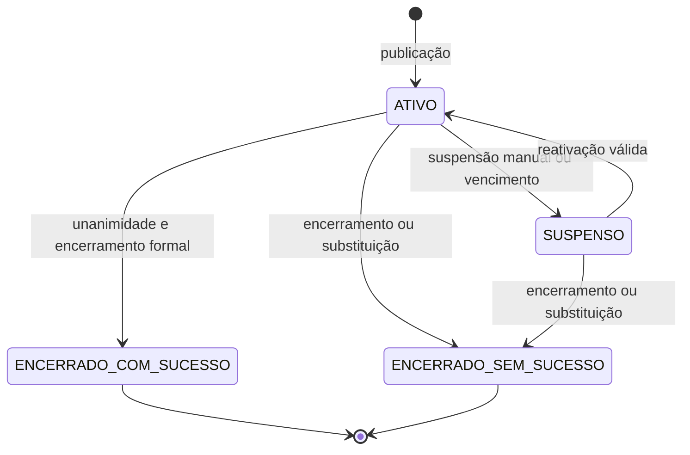

# Estados, transições e invariantes

## Processo

ABERTO → ENCERRADO_COM_SUCESSO ou ENCERRADO_SEM_SUCESSO; nenhuma volta. ABERTO pode existir sem ciclo ativo, antes da primeira publicação ou depois do encerramento de ciclo sem sucesso. Arquivado é condição administrativa pós-encerramento, não nova fase de apreciação.

## Ciclo

Publicação cria ATIVO. ATIVO → SUSPENSO por ação justificada ou vencimento. SUSPENSO → ATIVO por reativação. ATIVO → ENCERRADO_COM_SUCESSO com encerramento do processo. ATIVO/SUSPENSO → ENCERRADO_SEM_SUCESSO por encerramento de ciclo, de processo ou substituição. Sucesso a partir de SUSPENSO é proibido.

## Convite e conjunto de participantes

PENDENTE → ACEITO, RECUSADO ou EXPIRADO. Sem retorno de RECUSADO, mesmo reincluindo identidade. Remoção antes do fechamento registra elegibilidade separada, sem apagar aceite. Fechamento expira pendentes e congela aceitos não removidos; conjunto nunca muda depois. Nova publicação cria novos convites para vínculos ativos selecionados, com novos prazos e decisões.

## Matriz resumida

| Operação | Ativo | Suspenso | Sem ciclo corrente | Processo encerrado |
|---|---|---|---|---|
| Consulta do apreciador | Conforme visibilidade e participação | Não | Não | Não |
| Aceite/recusa | Convite pendente e prazo aberto | Não | Não | Não |
| Manifestação/alteração | Aceite elegível e prazo aberto | Não | Não | Não |
| Alterar anexo publicado | Não | Só sem qualquer manifestação | Não aplicável | Não |
| Preparar rascunho | Sim | Sim | Sim | Não |
| Publicar substituição/novo ciclo | Sim | Sim | Sim | Não |
| Encerrar ciclo sem sucesso | Sim, justificado | Sim, justificado | Não aplicável | Não |
| Encerrar processo sem sucesso | Sim, justificado | Sim, justificado | Sim, justificado | Não |
| Encerrar com sucesso | Só unânime após prazo convites | Não | Não | Não |
| Correção cadastral | Sim, justificada | Sim, justificada | Sim, justificada | Não |
| Arquivar | Não | Não | Não, se processo aberto | Administrador |

Operações internas sempre exigem papel/escopo. A matriz não dá ao apreciador poderes administrativos.

## Concorrência temporal

Unanimidade é derivada; não deve ser um estado de ciclo exclusivo. Pode existir enquanto suspenso, sem permitir sucesso. Mudança de manifestação pode desfazê-la em ciclo ativo. Encerramento fixa documento oficial e suas decisões. Se prazo vencer entre abrir tela e confirmar, servidor rejeita operação vencida e materializa suspensão quando necessário.

## Anexos

Preparação livre no rascunho dentro das permissões. Depois de publicado, qualquer manifestação torna a base documental daquele ciclo protegida contra mudança. A alteração permitida em suspensão sem manifestação cria composição nova e gera aviso na reativação. Declaração anterior de anexos alteráveis durante apreciação não é vigente.
