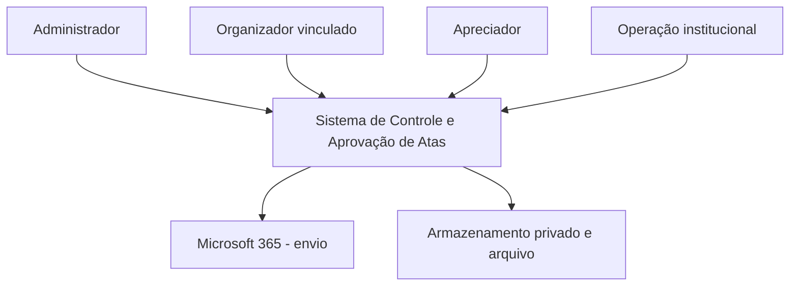
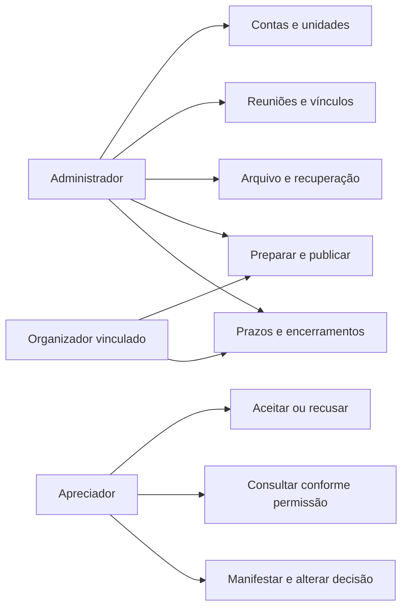

# Contexto e casos de uso

```mermaid
flowchart TB
    AD[Administrador] --> S[Sistema de Controle e Aprovação de Atas]
    OR[Organizador vinculado] --> S
    AP[Apreciador] --> S
    S --> M[Microsoft 365 - envio]
    OP[Operação institucional] --> S
    S --> AR[Armazenamento privado e arquivo]
```

```mermaid
flowchart LR
    A[Administrador] --> U[Contas e unidades]
    A --> R[Reuniões e vínculos]
    A --> F[Arquivo e recuperação]
    A --> P[Preparar e publicar]
    O[Organizador vinculado] --> P
    O --> E[Prazos e encerramentos]
    A --> E
    C[Apreciador] --> I[Aceitar ou recusar]
    C --> V[Consultar conforme permissão]
    C --> D[Manifestar e alterar decisão]
```

Sem integração de autenticação Microsoft, calendário ou leitura de caixas. Operação técnica não concede automaticamente poderes funcionais de Administrador.
