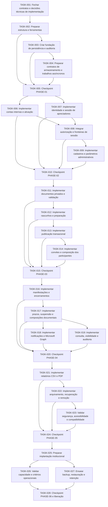

# Grafo de dependências

```mermaid
flowchart TD
    T001["TASK-001: Fechar contratos e decisões técnicas de implementação"]
    T002["TASK-002: Preparar estrutura e ferramentas"]
    T001 --> T002
    T003["TASK-003: Criar fundação de persistência e auditoria"]
    T002 --> T003
    T004["TASK-004: Preparar contratos de armazenamento e trabalhos assíncronos"]
    T003 --> T004
    T005["TASK-005: Checkpoint PHASE-01"]
    T002 --> T005
    T003 --> T005
    T004 --> T005
    T006["TASK-006: Implementar contas internas e ativação"]
    T005 --> T006
    T007["TASK-007: Implementar identidade e sessão de apreciadores"]
    T005 --> T007
    T008["TASK-008: Integrar autorização e fronteiras de sessão"]
    T006 --> T008
    T007 --> T008
    T009["TASK-009: Implementar cadastros e parâmetros administrativos"]
    T008 --> T009
    T010["TASK-010: Checkpoint PHASE-02"]
    T006 --> T010
    T007 --> T010
    T008 --> T010
    T009 --> T010
    T011["TASK-011: Implementar documentos privados e validação"]
    T010 --> T011
    T012["TASK-012: Implementar rascunhos e preparação"]
    T011 --> T012
    T013["TASK-013: Implementar publicação transacional"]
    T012 --> T013
    T014["TASK-014: Implementar convites e composição dos participantes"]
    T013 --> T014
    T015["TASK-015: Checkpoint PHASE-03"]
    T011 --> T015
    T012 --> T015
    T013 --> T015
    T014 --> T015
    T016["TASK-016: Implementar manifestações e encerramentos"]
    T015 --> T016
    T017["TASK-017: Implementar prazos, suspensão e composições documentais"]
    T016 --> T017
    T018["TASK-018: Implementar notificações e Microsoft Graph"]
    T017 --> T018
    T019["TASK-019: Implementar consulta, visibilidade e auditoria"]
    T017 --> T019
    T020["TASK-020: Checkpoint PHASE-04"]
    T016 --> T020
    T017 --> T020
    T018 --> T020
    T019 --> T020
    T021["TASK-021: Implementar relatórios CSV e PDF"]
    T020 --> T021
    T022["TASK-022: Implementar arquivamento, recuperação e remoção"]
    T021 --> T022
    T023["TASK-023: Validar segurança, acessibilidade e compatibilidade"]
    T022 --> T023
    T024["TASK-024: Checkpoint PHASE-05"]
    T021 --> T024
    T022 --> T024
    T023 --> T024
    T025["TASK-025: Preparar implantação institucional"]
    T024 --> T025
    T026["TASK-026: Validar capacidade e critérios operacionais"]
    T025 --> T026
    T027["TASK-027: Ensaiar backup, restauração e retenção"]
    T025 --> T027
    T028["TASK-028: Checkpoint PHASE-06 e liberação"]
    T026 --> T028
    T027 --> T028
```

Ordem topológica: TASK-001 a TASK-028 conforme índice. Gates institucionais adicionais em TASKS.md. Grafo não representa autorização de execução.
