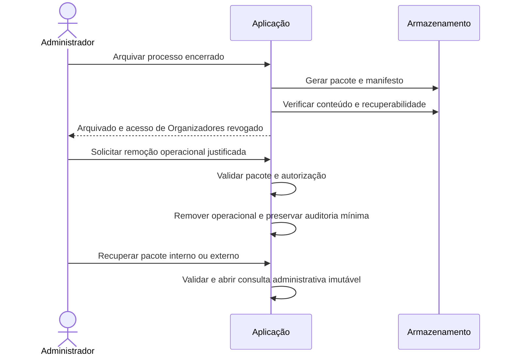

# Sequências principais

## Publicação

```mermaid
sequenceDiagram
    actor O as Organizador
    participant A as API
    participant D as MySQL
    participant J as Trabalhador
    participant G as Graph
    O->>A: Publicar rascunho e revisão esperada
    A->>D: Transação: validar e bloquear processo
    A->>D: Encerrar predecessor, criar ciclo e convites
    A->>D: Auditoria e intenção de envio; commit
    A-->>O: Ciclo publicado
    J->>D: Buscar trabalho elegível
    J->>G: Solicitar envio
    G-->>J: Aceitação ou erro
    J->>D: Registrar tentativa, sem presumir entrega
```

## Manifestação e encerramento

```mermaid
sequenceDiagram
    actor P as Apreciador
    participant A as API
    participant D as Banco
    actor O as Organizador
    P->>A: Decisão, texto, ciclo e composição esperados
    A->>D: Validar sessão, participação, prazo e revisão
    A->>D: Acrescentar manifestação e recalcular condição
    D-->>A: Commit
    A-->>P: Manifestação registrada
    O->>A: Encerrar processo com sucesso
    A->>D: Bloquear e revalidar unanimidade e estado
    alt Condições satisfeitas
        A->>D: Encerrar processo/ciclo e revogar links; commit
        A-->>O: Oficializado
    else Condições não satisfeitas
        A-->>O: Conflito ou regra impeditiva
    end
```

## Arquivo


